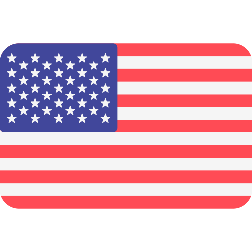

<!-- Header  -->

<!-- Choose Lang  -->

<table align="right">
  <tr>
    <td></td>
    <td></td>
  </tr>
</table>

<h2 align="left" id="my-tools">🦝 Hi there! How are you doing?</h2>

<!-- Badges  -->

  
  
  
  
  
  

<!-- Information  -->

- 🌱 &nbsp;I’m currently learning **[Go]**
- 📮 &nbsp;Ask me anything on my **[issues page]**
- 🦾 &nbsp;Passionate with problem solving and daily routines automation.
- 🧙🏻‍♂️ &nbsp;I am a Doctor of Minecraft Sciences
- 🌲 &nbsp;You can see some of my projects on **[my portfolio]**

 

<!-- My Favorite Tools -->

<h2 align="left" id="my-tools">🍱 My favorite tools</h2>

> Tools, languages, and other things that I like to work with.

<table>
  <tr>
    <td align="center" width="96"> Go</td>
    <td align="center" width="96"> Jsonnet</td>
    <td align="center" width="96"> TypeScript</td>
    <td align="center" width="96"> JavaScript</td>
    <td align="center" width="96"> Vue</td>
    <td align="center" width="96"> PHP</td>
    <td align="center" width="96"> Webpack</td>
    <td align="center" width="96"> Bootstrap</td>
    <td align="center" width="96"> Sass</td>
  </tr>
  <tr>
    <td align="center" width="96"> Docker</td>
    <td align="center"  width="96"> Debian</td>
    <td align="center"  width="96"> RHEL</td>
    <td align="center"  width="96"> MySQL</td>
    <td align="center"  width="96"> Redis</td>
    <td align="center"  width="96"> mongoDB</td>
    <td align="center"  width="96"> Vscode</td>
    <td align="center"  width="96"> Bash</td>
    <td align="center"  width="96"> SVG + XML</td>
  </tr>
</table>

You can see my full tech **[here]**

<h2 align="left" id="github-stats">🎯 Github stats</h2>

<!-- GitHub Profile Stats -->

 
  
💻 GitHub Profile Stats

   
  
  
   
  <b>Note:</b> Top languages is only a metric of the languages my public code consists of and doesn't reflect experience or skill level.

<!-- https://github.com/jamesgeorge007/github-activity-readme -->

  
⚡ Recent GitHub Activity

   

<!--START_SECTION:activity-->
<!--END_SECTION:activity-->

<!-- https://github.com/ashutosh00710/github-readme-activity-graph -->

 
 

<!-- Made With ... -->

Made with ❤️ for <strong>Github users</strong>

<!-- Links -->

[here]: https://emilakhadov.dev
[Go]: https://golang.org/
[my portfolio]: https://emilakhadov.dev
[issues page]: https://github.com/eakhadov/eakhadov/issues 'eakhadov/issues'
