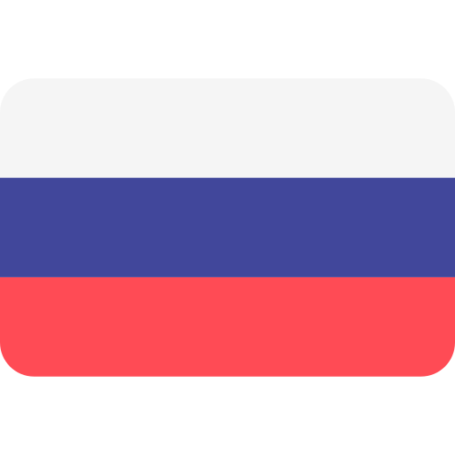

  

<table align="center">
  <tr>
    <td>
      
    </td>
    <td>
      
    </td>
  </tr>
</table>

##

  
  
  
  
  
  

- 🌱 &nbsp;I’m currently learning **Go**
- 📮 &nbsp;Ask me anything on my **[issues page]**
- 💓 &nbsp;Passionate with problem solving and daily routines automation.
- null
- null

 

  
  

<h2 align="left" id="my-tech">Favorite Tech</h2>

> Tools, languages, and other things that I like to work with.

<table>
  <tr>
    <td align="center" width="96">
      
       Go
    </td>
    <td align="center" width="96">
      
       Jsonnet
    </td>
    <td align="center" width="96">
      
       TypeScript
    </td>
    <td align="center" width="96">
      
       JavaScript
    </td>
    <td align="center" width="96">
      
       Vue
    </td>
    <td align="center" width="96">
      
       PHP
    </td>
    <td align="center" width="96">
      
       Webpack
    </td>
    <td align="center" width="96">
      
       Bootstrap
    </td>
    <td align="center" width="96">
      
       Sass
    </td>
  </tr>
  <tr>
    <td align="center" width="96"> 
      
       Docker
    </td>
    <td align="center"  width="96">
      
       Debian
    </td>
    <td align="center"  width="96">
      
       RHEL
    </td>
    <td align="center"  width="96">
      
       MySQL
    </td>
    <td align="center"  width="96">
      
       Redis
    </td>
    <td align="center"  width="96">
      
       mongoDB
    </td>
  </tr>
</table>

You can see my full tech **[here]**

 
 

Made with ❤️ for <strong>Github users</strong>

<!-- links -->

[here]: https://emilakhadov.dev
[issues page]: https://github.com/eakhadov/eakhadov/issues 'eakhadov/issues'
